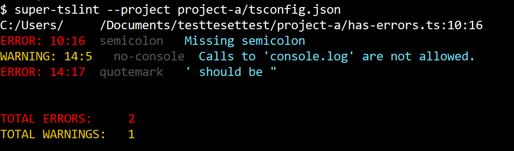

<p align="center">
  
</p>

# Super tslint
An extension of the tslint library adding the ability to watch files, better handle multiple nested tsconfigs, and more human readable output.

# Installation
install the npm package 
```bash
> npm i -g super-tslint
```
or if you prefer to install it locally
```bash
> npm i --save-dev super-tslint
> node ./node_modules/super-tslint/bin/super-tslint  ...
```

# Usage

### Flags
```bash
        -p, --project [path]    path to tsconfig, lints entire project.
        -q, --quote             a bit of inspiration.
        -h, --help              shows this dialog.

        --all                   lints all nested tsconfig.* projects.
        --fix                   auto fixes compatible errors.
        --watch                 watches files for on save and re-runs linter.
```

### Lint a project
```bash
> super-tslint --project example/project-a/tsconfig.json
```

### Lint a single file
```bash
> super-tslint path/to/file.ts
```

### Lint and auto fix a project
```bash
> super-tslint --fix --project example/project-a/tsconfig.json
```

### Lint all nested tsconfigs
this will lint all ts projects nested from the current directory
```bash
> super-tslint --all
```

### Lint and watch for changes
```bash
> super-tslint --watch --project example/project-a/tsconfig.json
```

### Lint and watch all 
```bash
> super-tslint --watch --all
```

### Inspire yourself to write better code
```bash
> super-tslint --quote
```

# Setting up multiple tsconfigs
For the following example, lets say we have the below project structure
```bash
|____projects
|   |__proj-a
|   |  |__file-a.ts
|   |  |__tsconfig.json
|   |
|   |__proj-b
|   |  |__file-b.ts
|   |  |__tsconfig.json
|   |
|   |__tslint.json
|
|__tslint.json
```

In the root `tslint.json`, define your general rules for the entire repo. You can also choose to include or exclude certain file globs here.
```json
{
  "extends": "tslint:recommended",
  "rules": {}
}
```
In the `projects/tslint.json`, you can extend the root config and make changes to your specific nested files. Tslint will always use the closest `tslint.json` as it's ruleset.
```json
{
  "extends": "../tslint.json",
  "rules": {
    "member-access": false,
    "no-console": {
      "severity": "warning"
    }
  },
  "linterOptions": {
    "exclude": [
      "**/typings/**"
    ]
  }
}
```
An example `tsconfig.json`
```json
{
  "compilerOptions": {
      "alwaysStrict": true,
      "noImplicitAny": true,
      "removeComments": true,
      "preserveConstEnums": true,
      "outFile": "proj-a-bundle.js",
      "sourceMap": true
  },
  "exclude": [
      "node_modules",
      "**/*.spec.ts"
  ]
}
```

And then to lint all nested projects run
```bash
> super-tslint --all
```
which could produce the following example output
```
C:/root/projects/proj-a/file-a.ts:10:16
ERROR: 10:16            semicolon                Missing semicolon
WARNING: 14:5            no-console             Calls to 'console.log' are not allowed.
ERROR: 14:17            quotemark                ' should be "

C:/root/projects/proj-b/file-b.ts:10:16
ERROR: 10:16            semicolon                Missing semicolon


TOTAL ERRORS:     3
TOTAL WARNINGS:   1
```

### Exit codes
If any error occurs during linting, process will return exit status 1 (this does not include warnings).

### Example output coloring
<p align="center">
  
</p>

